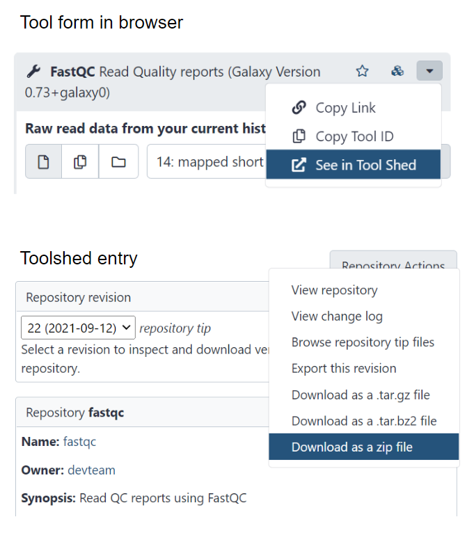
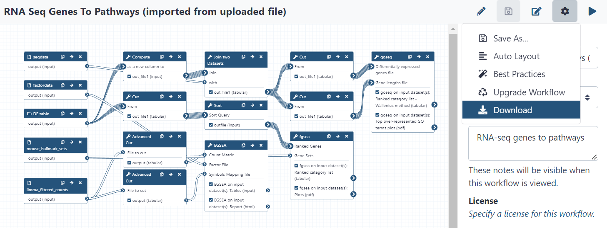
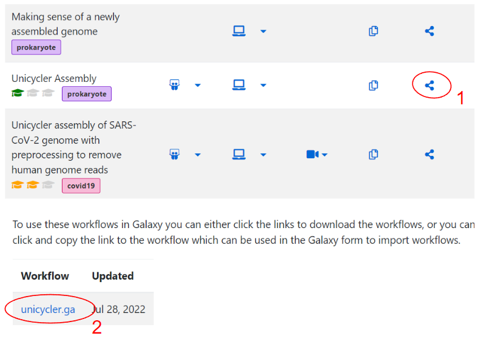

# Galaxy to Janis Translation

Galaxy2janis is a productivity tool which translates Galaxy tool wrappers and workflows into the Janis language. <br>
It accepts either a Galaxy wrapper (.xml) or workflow (.ga) and will produce a Janis definition (.py).

This software is part the [Portable Pipelines Project](https://www.melbournebioinformatics.org.au/project/ppp/) which produces technologies to make workflow execution and sharing easier. 

Galaxy2janis is currently available in pre-release form.

**Bugs:** Please submit any bugs by [raising an issue](https://github.com/GraceAHall/galaxy2janis/issues) to help improve the software!<br>
**Contributing:**  Please get in touch by [raising an issue](https://github.com/GraceAHall/galaxy2janis/issues) so we can communicate via email or zoom.<br>


## Contents

- [Quickstart Guide](#quickstart-guide)
- [Description](#description)
- [Inputs](#inputs)
- [Outputs](#outputs)
- [Translation (CWL / WDL / Nextflow)](#translation-(cwl-/-wdl-/-nextflow))
- [Supported Features](#supported-features)

## Quickstart Guide

Galaxy2janis is available as a PyPI package. 
It requires python ≥ 3.10. 

Quickstart:

```
# create & activate environemnt
python3.10 -m venv venv
source venv/bin/activate
```

```
# install package
pip install galaxy2janis
```

```
# tool translation
galaxy2janis tool [PATH]
galaxy2janis tool abricate/abricate.xml

# workflow translation
galaxy2janis workflow [PATH]
galaxy2janis workflow hybrid_assembly.ga
```

## Description

#### What does this program do?

Galaxy2janis is a *productivity tool*. 

Given a *galaxy tool wrapper* or *galaxy workflow*, it will extract as much information as possible, and will create a similar definition in ***[Janis](https://janis.readthedocs.io/en/latest/index.html)***. 

For tool translations, the main software requirement will be identified and translated to Janis. A container will also be identified which can run the output Janis tool.

For workflow translations, the workflow itself will be translated to a Janis definition, alongside each tool used in the workflow.

#### What does this program not do?

Provide *runnable* translations.

Galaxy2janis does not provide translations which are runnable. They are intended to be human readable, and to match the structure of the input workflow. Users are expected to make some ***manual edits*** to finalise the workflow. See the [Manual Edits Section](#manual-edits) for details. 

## Inputs

#### Tool translation

A local copy of the galaxy tool wrapper is needed. To download a tool wrapper: 
- Select the tool in galaxy
- View its toolshed entry *(top-left caret dropdown, 'See in Tool Shed')*
- Download the wrapper as a zip file *(repository actions -> 'Download as a zip file')*



The unzipped file is the wrapper for that galaxy tool. 

Once the wrapper has been obtained, the path to the specific tool to translate must be specified. For example, if you downloaded the abricate tool you may something similar to this structure:

```
abricate/
├── abricate.xml
├── macros.xml
└── test-data
    ├── Acetobacter.fna
    ├── MRSA0252.fna
    └── output_db-card.txt
```

To translate abricate.xml:
```
galaxy2janis tool abricate/abricate.xml
```

<br>

#### Workflow Translation

A local copy of the galaxy workflow is needed. There are two methods to download a workflow:

1. Download from workflow editor<br>


2. Download from Galaxy Training Network (GTN)<br>


These will download a galaxy workflow file in *.ga* format. 

To translate the workflow:
```
galaxy2janis workflow downloaded_workflow.ga
```

Each tool used in the workflow will be downloaded and translated automatically during the process. 

## Outputs

Tool translations produce a single Janis tool definition for in the input galaxy wrapper. 

Workflow translations produce an output folder containing multiple files. Workflows need multiple entities such as tool definitions, the main workflow file, scripts, and a place to provide input values to run the workflow. The current output structure is as follows: 

```
[translated_workflow]/
├── inputs.yaml             # input values
├── logs                
├── subworkflows    
├── tools                   # tool definitions
│   ├── scripts             # tool scripts
│   ├── untranslated        # untranslated tool logic (galaxy)
│   └── wrappers            # translated tool wrappers (galaxy)
└── workflow.py             # main workflow file
```

## Translation (CWL / WDL / Nextflow)

#### Janis Translate

Galaxy -> Janis -> CWL/WDL/Nextflow

This program ingests Galaxy definitions to produce Janis definitions. <br>
Janis' inbuilt `translate` functionality can subsequently output to the languages seen above. 

For example, translating the `abriate` tool from Galaxy to CWL:

```
# galaxy -> janis
galaxy2janis tool abricate/abricate.xml         (produces abricate.py)

# janis -> CWL
janis translate abricate.py > abricate.cwl
```

#### Making Runnable

It is the responsibility of the user to make final edits & bring the workflow to a runnable state.

This tool is designed to increase productivity when migrating workflows; as such, the outputs it produces favour readability over completeness. 

To aid users in this process, some sources files are retained. 

`tools/untranslated`

Contains untranslated galaxy tool logic. Galaxy tool wrappers may perform multiple tasks when executed. The main software tool being wrapped will execute, but some preprocessing or postprocessing steps may also be performed. A common structure is as follows:
- Preprocessing (symlinks / making directories / creating a genome index)
- Main software requirement (actual tool execution)
- Postprocessing (index or sort output / create additional output files / summaries)

Galaxy2janis translates the main software requirement into a Janis definition. Preprocessing and postprocessing logic are placed into the `tools/untranslated` folder as a reference, so the user can see what has been ignored. 

`tools/wrappers`

Contains galaxy tools which were translated. They are the 'source files' which we used to create Janis tool definitions while the workflow was being parsed.  Can be used as reference when tool translations weren't good quality. <br>
Galaxy wrappers have a distinct style, so see the [galaxy tool xml documentation](https://docs.galaxyproject.org/en/latest/dev/schema.html) for details. 


## Supported Features

This project is in active development. Many features are planned, and will be released over time.

#### unsupported

Features

- \<command> `#def #set #if #for` cheetah logic
- \<command> `Rscript -e` (inline Rscripts)
- \<param> `type="color"` params
- xml features seen in 1% of tools 

Wrappers

- `emboss` suite of tool wrappers known to fail due to legacy features.


